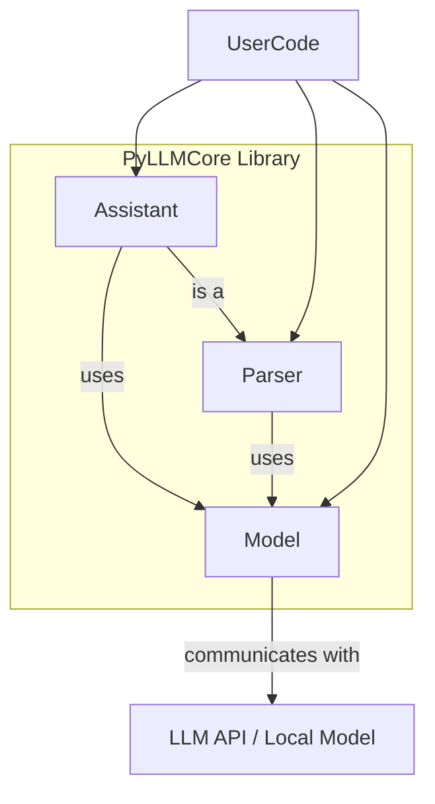

# Welcome to PyLLMCore Documentation

PyLLMCore is a lightweight Python library designed to provide a simple and efficient interface for interacting with Large Language Models (LLMs). This documentation will help you understand its core components and how to use them effectively.

## Core Concepts

PyLLMCore is built around three main types of components: Models, Parsers, and Assistants. Understanding their roles and interactions is key to leveraging the library.

### 1. Models (`llm_core.llm`)

*   **Role:** Models are the foundational layer that directly communicates with the LLM APIs (like OpenAI, Anthropic, etc.) or local model backends (like `llama-cpp-python` for GGUF models).
*   **Functionality:** They handle the raw communication, including sending prompts, managing API keys (implicitly), and receiving responses. They provide a base level of abstraction over the specific details of each LLM provider.
*   **Key Class:** `llm_core.llm.base.LLMBase` is the abstract base class, with provider-specific implementations like `OpenAIChatModel`, `MistralAIModel`, etc.
*   **Output:** Typically return a structured `ChatCompletion` object containing the LLM's response, usage statistics, and any tool calls.

### 2. Parsers (`llm_core.parsers`)

*   **Role:** Parsers are specialized tools for structured data extraction. They use a Model to populate a Python dataclass you define.
*   **Functionality:** You provide a dataclass (`target_cls`) and unstructured text (or an image). The Parser instructs the underlying Model to extract information matching the schema of your dataclass and then automatically populates an instance of it.
*   **Key Class:** `llm_core.parsers.BaseParser` is the base, with provider-specific implementations like `OpenAIParser`.
*   **Usage:** Ideal for tasks like extracting information from documents, processing user queries into a defined format, etc.

### 3. Assistants (`llm_core.assistants`)

*   **Role:** Assistants are higher-level components designed for more complex interactions, often involving tool use (function calling) and sophisticated prompting strategies.
*   **Functionality:**
    *   They take a `target_cls` (dataclass) which defines both the desired structured output AND can specify the system and user prompts for the interaction.
    *   They can orchestrate calls to external tools (defined as dataclasses with a `__call__` method) to gather information or perform actions.
    *   The LLM decides if and how to use these tools based on the prompt and tool definitions.
*   **Key Class:** `llm_core.assistants.base.BaseAssistant` is the base, with provider-specific implementations like `OpenAIAssistant`.
*   **Inheritance Note:** `BaseAssistant` inherits from `BaseParser`. This means an Assistant *is a* Parser and leverages its parsing capabilities to produce the final structured output.

### Relationships

Here's how these components generally interact:

*(Note: Mermaid diagram will render in environments that support it. It shows User Code can use Assistant, Parser, or Model directly. Assistant uses Model and is a type of Parser. Parser uses Model. Model communicates with the LLM backend.)*

### The `target_cls` (Dataclass)

The `target_cls` is a crucial concept for both Parsers and Assistants:

*   **For Parsers:** The `target_cls` defines the schema for the data you want to extract. The parser will return an instance of this dataclass.
*   **For Assistants:**
    *   The `target_cls` defines the schema for the final structured response from the assistant.
    *   Additionally, the `target_cls` can have `system_prompt` and `prompt` string attributes. The Assistant will use these (formatted with any provided arguments) to interact with the Model.

### Unified Response Objects

When you interact directly with a Model (e.g., using its `ask()` method), you'll typically receive a `ChatCompletion` object. This object, defined in `llm_core.llm.base`, provides a somewhat standardized structure for LLM responses:

*   **`ChatCompletion`**: The main container.
    *   `id`: A unique ID for the completion.
    *   `model`: The model name used.
    *   `choices`: A list of `ChatCompletionChoice` objects (usually one).
    *   `usage`: A `Usage` object detailing token counts.
*   **`ChatCompletionChoice`**: Represents one possible completion.
    *   `message`: A `Message` object containing the actual content.
    *   `finish_reason`: Why the LLM stopped generating (e.g., "stop", "tool_calls").
*   **`Message`**:
    *   `role`: "assistant", "user", etc.
    *   `content`: The textual content of the message.
    *   `tool_calls`: If the LLM wants to call tools.
*   **`Usage`**:
    *   `prompt_tokens`: Tokens in the input.
    *   `completion_tokens`: Tokens in the output.
    *   `total_tokens`: Sum of prompt and completion tokens.

Understanding these objects is helpful for debugging and for more advanced interactions with the Models.
